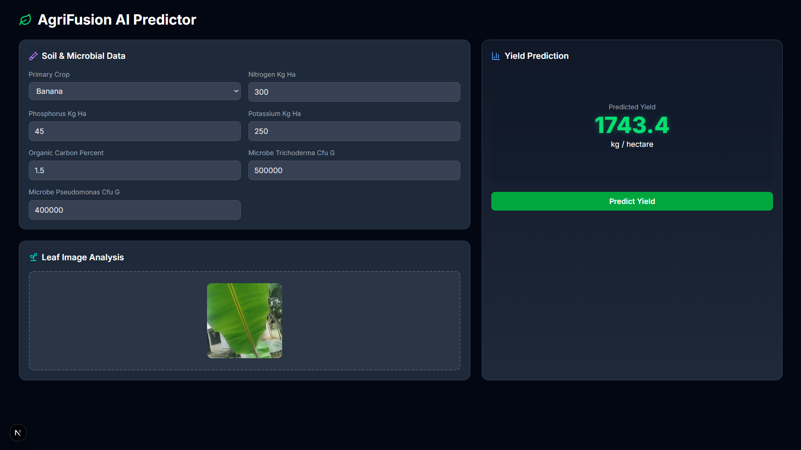

# AgriFusion AI: Multi-Modal Crop Yield Prediction System



## 1. Project Overview

AgriFusion AI is a full-stack, AI-driven platform designed to provide highly accurate crop yield predictions for complex mixed-cropping environments. It leverages a unique multi-modal AI fusion model that integrates real-time environmental readings, comprehensive soil analysis, and visual leaf health assessment to offer more robust and holistic forecasts than traditional single-source approaches.

This project represents an end-to-end solution, from IoT data acquisition to a responsive web interface for user interaction and AI-driven insights.

## 2. Key Features

* **Multi-Modal AI Engine**: A core TensorFlow/Keras model that intelligently fuses outputs from specialized neural networks (CNN-LSTM, DNN, CNN) for superior prediction accuracy.
* **Full-Stack Web Application**: An intuitive user interface built with **Next.js** and **React** that communicates with a robust **Python/Flask** REST API for model serving.
* **IoT & Edge Architecture**: A complete data pipeline design, from an **ESP32-based sensor node** for real-time data collection to a deployment strategy for on-field inference on an **NVIDIA Jetson Orin**.

## 3. Technology Stack

* **AI & Backend**: Python, TensorFlow, Keras, Flask, Scikit-learn
* **Frontend**: Next.js, React, TypeScript, Tailwind CSS, Framer Motion
* **IoT & Edge**: ESP32, NVIDIA Jetson Orin

## 4. Local Setup & Installation

Follow these steps to run the project on your local machine.

### Prerequisites

* Git
* Python 3.9+ and pip
* Node.js and npm

### Step A: Clone the Repository

```bash
git clone https://github.com/Akashkumarfortuner/Mixed-crop-ai.git